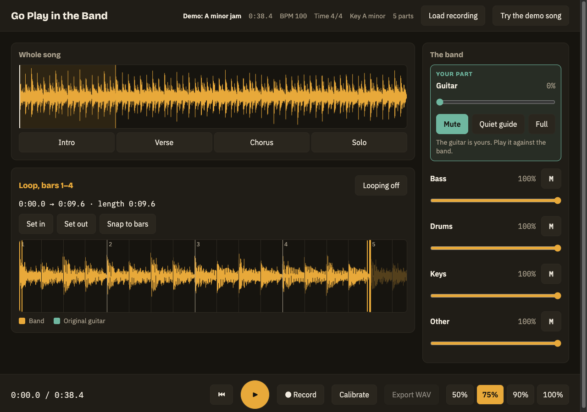
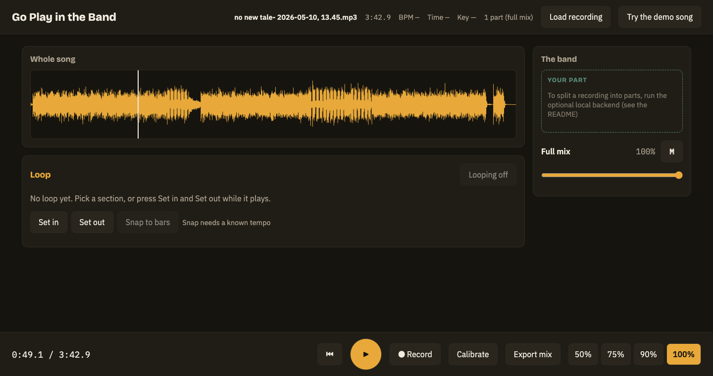

# Go Play in the Band

**[Try it in your browser →](https://brucehoppe.github.io/go-play-in-the-band/)** nothing to install; it runs on a built-in demo song.

Coded by Bruce Hoppe

> **This is a thought experiment and proof of concept (POC), not a finished product.**
> It explores what a guitarist's play-along practice tool could feel like, and how far a
> browser (TypeScript, plus Rust compiled to WebAssembly) can take it. Parts of it have
> not been tested on real hardware or by ear; see [Status](#status). Expect rough edges,
> and do not rely on it.

A play-along practice app for guitarists. Load a recording, turn the original guitar
down or out, loop a hard section, slow it down, and record yourself playing the part
against the rest of the band, so you feel like the guitarist in the band.

## Screenshots

Your own recording, loaded as a single "Full mix" (no backend needed):

More: [start screen](docs/screenshots/01-start.png), [demo loaded](docs/screenshots/02-demo-loaded.png),
[a recorded take as a new part](docs/screenshots/04-overdub-take.png).

## Status

What exists so far:

- **Load and play.** Load a file (WAV, MP3, FLAC, M4A) or the demo song. See the whole song
  as a waveform (computed in Rust/WASM), click to seek, play and pause.
- **Loops.** Drag the IN/OUT handles (or nudge them with the arrow keys), snap them to bars,
  or click a section chip. Looping is sample-accurate with a short crossfade.
- **Band mixer.** The demo song is a five-part band (guitar, bass, drums, keys, other), with a
  fader and mute for each part. The guitar card, YOUR PART, has Mute, Quiet guide and Full
  presets. Gain changes are smoothed over about 10 ms, so they never click.
- **Speed.** 50, 75, 90 or 100%. Each speed is pre-rendered by our own WSOLA time-stretcher
  (Rust/WASM, in a worker), so playback stays exact. The first switch shows "Preparing…".
- **Record and overdub.** Record a take from the microphone (raw, no processing). Each take
  becomes a new part in the mixer ("Take 1", "Take 2", …) with its own fader and mute, so you
  can keep recording on top. With nothing loaded, Record makes your first take the song and
  later takes layer over it. Takes are saved in your browser (IndexedDB) and come back when
  you reopen the same song. Recording works at 100% speed. Use headphones, or the mic
  re-records the band. A Calibrate button measures round-trip latency with a click.
- **Export.** "Export mix" writes what you hear (every part at its level, mutes respected)
  as a WAV, with headroom so it does not clip.
- **Optional local backend** (`server/`). If it is running, opening a file splits it into
  parts with Demucs; without it a file is a single "Full mix". The demo needs no backend.
- **Offline.** A service worker caches the demo after the first visit.

What has **not** been verified:

- Stretch quality on guitar at 50% and 75% has not been judged by ear.
- Recording, overdubbing and calibration have only been run with a fake microphone, so
  whether layers line up in time on real hardware is unknown.
- Stem separation has not been run against real Demucs output.
- Windows is checked in CI only, not by hand.

Checked so far: unit tests (web, Rust and server), type-checking, the production build, and a
headless Chrome run (demo and a real four-minute recording load, speed switches, Record and
Stop, no console errors). See [CHANGELOG.md](CHANGELOG.md) and `docs/superpowers/specs/`.

## Develop

Needs Node.js 24+, Rust (stable) with the `wasm32-unknown-unknown` target, and
`wasm-pack` (`cargo install wasm-pack`). Works on Windows and macOS.

    cd web
    npm install
    npm run dev        # builds the WASM core, then serves the app
    npm test           # unit tests
    cargo test --manifest-path ../dsp-core/Cargo.toml

### Optional local backend

Only needed to split a recording into parts. It listens on 127.0.0.1 only.

    scripts/install.sh          # macOS; scripts\install.ps1 on Windows
    .venv/bin/python -m pip install demucs librosa    # large; separation and tempo
    scripts/run-server.sh       # scripts\run-server.ps1 on Windows

Nothing you load leaves your computer.

## Licence

MIT. See [LICENSE](LICENSE) and [THIRD_PARTY_NOTICES.md](THIRD_PARTY_NOTICES.md).
